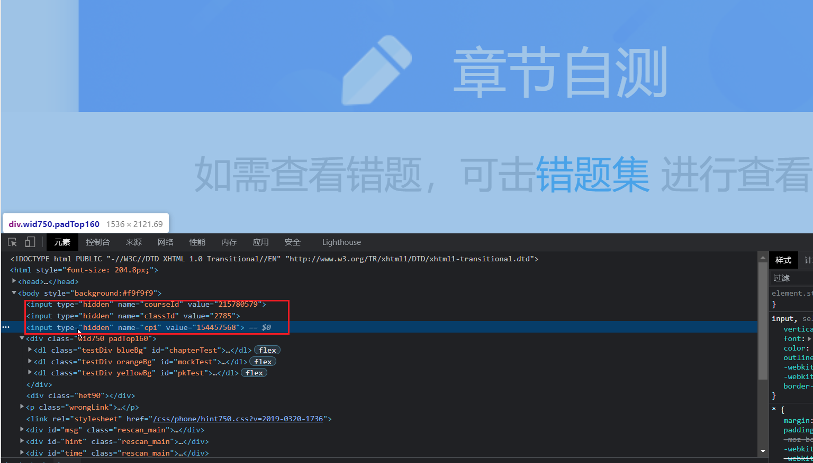

# xxt

> 学习通题库爬虫

博客：https://blog.notnotype.com/2022/03/27/%E5%AD%A6%E4%B9%A0%E9%80%9A%E9%80%86%E5%90%91/

# 使用

## clone项目

```shell
git clone https://www.github.com/notnotype/xxt.git
cd xxt
pip install -r requirements.txt
```

## 抓包获取course_id class_id cpi

### 方法一, 模拟器抓包

使用安卓模拟器于fiddle抓包

进入这两个界面


选择你想爬的课程


可以在fiddle中找到请求 `https://exm-mayuan-ans.chaoxing.com/selftest/chapter-test?courseId=xxx&classId=xxxx&cpi=xxx`

三个参数在其中

### 方法二, 浏览器抓包

(1)获取fid

登录网页版xxt

http://i.chaoxing.com/

然后访问该页面获取学院fid

http://i.chaoxing.com/base/cacheUserOrg

(2)获取courseId

http://i.chaoxing.com/base/cacheUserOrg

将获取的fid填入下面url中访问

https://exm-mayuan-ans.chaoxing.com/selftest/courses?fid=137737

在一个class=infoList的ul节点中获取courseId, (ul子节点li的id为courseId)

(3)获取三个参数

https://exm-mayuan-ans.chaoxing.com/selftest/mode?courseId=215780579

在html中找到三个参数



## 修改main.py文件

将参数填入修改原来的main.py(140行)

```python
xxt = XXT('215780579', '2546', '98652693')
```

## 运行

命令行输入`python main.py`来运行

# 声明

请勿将此项目用于除学习以外的其他用途
